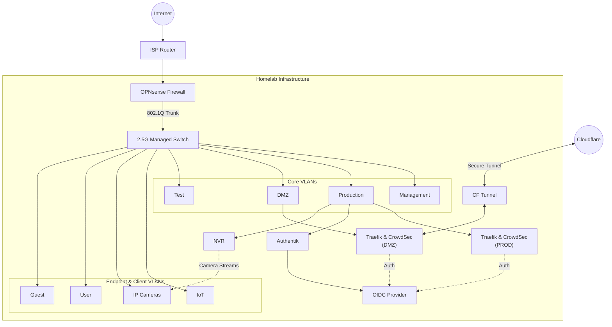
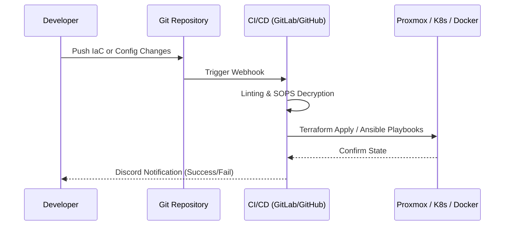
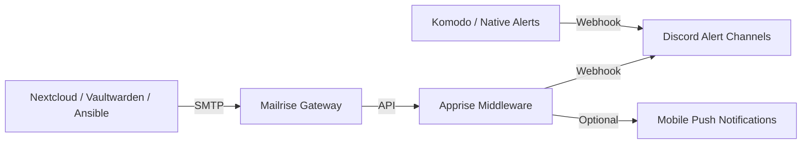

I maintain a highly customized self-hosted homelab environment to run infrastructure services, containerized workloads, and automated GitOps pipelines. What began as a simple collection of self-hosted apps has evolved into a strict, declarative Infrastructure-as-Code (IaC) repository built to simulate enterprise-grade, high-availability data center operations on personal hardware.

This documentation covers the architecture, automated provisioning, complex network routing, container orchestration, observability, security, and secret management across my physical and virtual environments.

---

## 🏗 Architecture & Network Topology

The infrastructure is logically split to isolate public-facing services from internal production and testing workloads. At the core, **Proxmox VE** provides the virtualization backbone. **TrueNAS SCALE** manages the ZFS storage arrays, providing highly available NFS/SMB shares to the cluster. The physical layer utilizes a MikroTik switch featuring 2.5 Gigabit ports to ensure high-speed throughput between the virtualization nodes and the storage backend without bottlenecks.

### Logical Network Segmentation

Traffic is strictly segmented and routed via an **OPNSense** edge firewall using VLANs. To enforce a zero-trust physical layer, all unused switch ports remain unassigned and disabled by default.

- **Management VLAN:** Subnet specifically hosting hardware & key infrastructure administration panels such as Proxmox Graphical User Intreface, OPNSense Admin Console and the Managed Switch User Interface.
- **Production VLAN:** Internal core services. Hosts Kubernetes clusters, Docker workloads, PostgreSQL/Redis databases, monitoring systems, NVR technologies, Smart Home Core, and infrastructure APIs.
- **DMZ VLAN (Public Edge):** Hosts VPN endpoints and externally accessible services such as Nextcloud, Immich, and Vaultwarden, exposed securely through Cloudflare tunnels.
- **IoT VLAN:** Isolated smart home devices hosting Home Assistant, Zigbee2MQTT, Node-RED, and MQTT brokers.
- **Test VLAN:** Ephemeral environments for Kubernetes test clusters, CI/CD agents, and database staging mirrors.
- **IP Cameras VLAN:** High-bandwidth subnet for IP cameras, blocking internet access and granting incoming access only to the NVR.
- **User VLAN:** Trusted personal devices with internal DNS access and controlled access to selected Production and IoT services.
- **Guest VLAN:** Untrusted personal devices with internal DNS access, isolated from the rest of the network.

### High-Level Topology Schema

---

## ⚙️ Infrastructure Automation & GitOps

To eliminate configuration drift, manual intervention is strictly minimized. The environment is provisioned and maintained through automated pipelines defined in my IaC repository.

### Provisioning Pipeline

1. **Packer:** Bakes immutable, pre-configured base OS templates.
2. **Terraform:** Consumes Packer templates for rapid, declarative provisioning of Proxmox VMs and LXC containers based on environment state files.
3. **Ansible:** Bootstraps and configures fresh VMs and LXCs, handling system setup, user creation, SSH key distribution, Docker runtimes, and TrueNAS storage integration, while serving as the configuration engine for ongoing system updates.

### GitOps Workflow Schema

---

## 🔒 Security, Access & Identity

Security is enforced at the edge, the application layer, and the container runtime. Container workloads are heavily hardened; the Docker socket is explicitly **not** mapped to containers unless absolutely required, and is instead routed through a secure `socket-proxy`, reducing exposure to container-based privilege escalation.

### Unified Edge Security & WAF

- **Traefik Proxy & Automatic TLS Management:** Acts as the sole entry point for web traffic, routing dynamically based on container labels and automating Let's Encrypt wildcard certificate management through DNS challenges.
- **CrowdSec WAF:** Deployed across Traefik ingress proxies and the OPNSense firewall. This provides collaborative, behavior-based intrusion prevention against brute-force attacks, port scans, and malicious payloads.

### Identity & Secrets Management

- **Authentik OIDC:** Serves as the central Identity Provider (IdP) for local and public endpoints, shielding services behind strict, unified authentication flows.
- **SOPS & Age:** Repository secrets such as API keys, database passwords, and TLS material are encrypted in Git using Mozilla SOPS. A single, heavily secured Age key is required to decrypt the environment, balancing strong secret protection with operational simplicity.

### Zero-Trust Remote Access (VPN & Mesh)

Access to the homelab is handled transparently across multiple physical locations:

1. **Site-to-Site WireGuard:** An OPNSense WireGuard server connects remote OpenWrt routers at secondary locations. Clients connecting to specific Wi-Fi SSIDs at these locations are seamlessly bridged into the homelab mesh, requiring zero client-side configuration.
2. **Tailscale ACLs:** Administrative access is governed by Tailscale with strict, tag-based Access Control Lists (ACLs):
   - `group:admin` maintains unrestricted SSH and service access to all tagged environments.
   - `group:family` is restricted to accessing web interfaces for `tag:dmz` self-hosted applications.
   - `group:guest` is explicitly denied access to internal resources.

---

## 📊 Observability & Notifications

System telemetry and alerts are centralized to ensure high availability, rapid incident response, and continuous performance tuning.

### Monitoring Ecosystem

- **The Classic Stack:** **Prometheus** aggregates hardware and container metrics through **Node Exporter** and cAdvisor, which are visualized through highly customized **Grafana** dashboards. InfluxDB is utilized for specific long-term time-series data.
- **Hypervisor & System Monitoring:** **Pulse** is deployed specifically for deep-dive Proxmox VE telemetry, alongside **Beszel** for lightweight, real-time system monitoring.
- **Container Management:** **Komodo** is utilized for managing Docker stacks and provides its own native alerting mechanism.

### Unified Notification Pipeline

Whether it is a Komodo stack alert, a Proxmox metric threshold, or a general system event, all infrastructure notifications are ultimately routed to **Discord**.

I utilize a custom domain managed by Mailgun to centralize legacy alerts. Applications that strictly require standard SMTP endpoints, such as Nextcloud, Authentik, Vaultwarden password resets, or Ansible playbook outputs, route their emails into **Mailrise**.

Mailrise acts as an SMTP gateway, translating these emails and forwarding them to **Apprise**, which then instantly pushes the formatted alerts to dedicated Discord webhook channels, operating alongside native webhooks sent from tools such as Komodo.

---

## ⚡ Smart Power Automation & Backup Strategy

To optimize hardware longevity and power draw without sacrificing data integrity, the Proxmox Backup Server (PBS) is fully automated to wake up only when scheduled tasks such as backups, verification, or garbage collection are required, and power down safely afterward.

Because PBS handles different tasks at different times, I engineered a unified watcher service to prevent race conditions or unexpected shutdowns during manual administration.

### Automatic Backup Workflow

1. **PVE Systemd Timers:** The Proxmox host utilizes systemd timers to trigger a startup script at the exact intervals required for backups or maintenance.
2. **Ephemeral Flagging:** Once the PBS guest agent reports readiness, the host script injects an ephemeral flag file (`/run/should-autoshutdown`) directly into the PBS VM's volatile memory.
3. **PBS Watcher Service:** A continuous watcher script inside PBS polls the task list every few minutes. It checks for active sync, backup, or GC tasks. Once all tasks complete **and** the ephemeral flag file is present, it removes the flag and gracefully powers off the VM.

> **Safety Guarantee:** Manual backups or maintenance starts do not generate the flag file. This ensures the server remains online while an administrator is actively working or restoring data.

---

## 📁 Repository

The complete Infrastructure-as-Code implementation, including Terraform, Ansible, automation scripts, service configurations, and supporting infrastructure definitions, is available in the public repository:

**[→ View the complete IaC repository](https://github.com/john-fotis/iac)**
